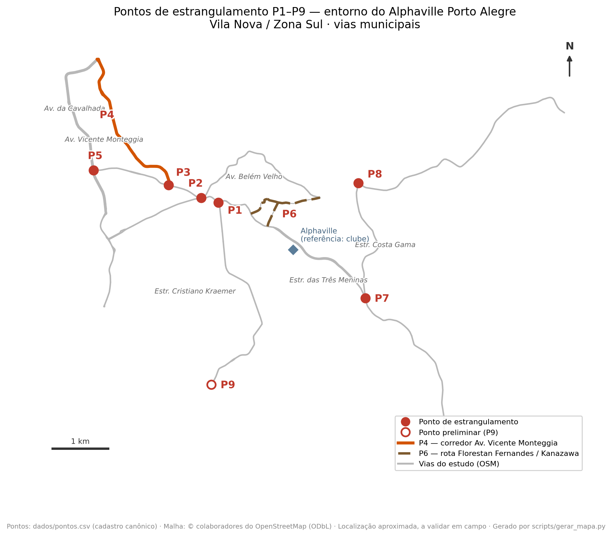

<!-- GERADO por scripts/build_pacote.py — NÃO editar à mão. Fontes: relatorios/guia-validacao-comissao.md, relatorios/memorando-externo.md, relatorios/anexo-matriz-pontos.md -->

```{=latex}
\newpage
```

# Guia de validação com a comissão + encaminhamento à EPTC

> **Caminho escolhido:** protocolar com a evidência já disponível — sinistros, série da
> sonda e documentação oficial — e solicitar à EPTC os dados e a vistoria técnica que a
> comunidade não tem condições de produzir. Coleta física e questionário permanecem em
> espera por falta de mobilização e **não são condições do protocolo**.

## 1. O que está pronto para revisão
- **Peças externas:** [memorando institucional](relatorios/memorando-externo.md) · [rascunho de ofício](relatorios/oficio-eptc-rascunho.md) · [anexo de pontos](relatorios/anexo-matriz-pontos.md).
- **Técnico:** [mapa dos pontos](mapas/mapa-pontos.png) · [matriz dos pontos (8 + P9)](propostas/problemas-priorizados.md) · [avaliação das soluções](propostas/avaliacao-solucoes-iniciais.md) · [base de sinistros](dados/tratados/acidentes_resumo_distancia_pontos.csv).
- **Evidência em consolidação:** [sonda de tempos](campo/sonda-tempos-google.md) (12 rotas, dados brutos privados; agregar antes de circular) · [capturas do trânsito típico](campo/observacoes/transito-tipico/README.md) · [acompanhamento das LAIs](relatorios/pedidos-informacao-lai.md#acompanhamento).
- **Referências para a vistoria técnica:** [plano de coleta](campo/plano-coleta-campo.md) · [roteiro](campo/observacoes/roteiro-vistoria.md) · [ficha CSV](campo/observacoes/modelo-observacao-campo.csv).

## 2. Decisões da comissão (checklist)
- [ ] **Validar a lista de pontos** (8 + P9). Algum a remover, fundir ou incluir?
- [x] **Grafia** "Estr. Cristiano **Kraemer**" — confirmada pela comissão.
- [ ] **Aprovar/editar** o texto do memorando externo e do ofício; preencher `[nome / contato]`.
- [ ] **Destino de D2 (retorno) e D3 (alargamento):** manter **internas** até provar benefício público? *(recomendação: sim)*
- [ ] **P9 (Rótula da Vila Nova):** confirmar como ponto rastreado.
- [ ] **Quem assina e protocola**, e por qual canal (EPTC – Solicitações de Trânsito / Subprefeitura Centro-Sul).
- [ ] **Confirmar o encaminhamento:** protocolo baseado em sonda, sinistros e LAIs, com pedido explícito de dados e vistoria técnica da EPTC; coleta comunitária e questionário ficam em espera.

## 3. Consolidação antes da reunião de 13/8

- **Sonda:** verificar continuidade e gerar agregados por rota e horário: atraso versus
  fluxo livre, assimetria direcional no P4 e custo do retorno no P7. Declarar a janela de
  coleta e as limitações; não anexar nem publicar dados brutos da Google Routes API.
- **LAIs:** até 03/08, incorporar respostas à [matriz de status](relatorios/matriz-publica-status-plano-funcional.md) ou registrar prorrogação/atraso. O pedido 7 pode informar Waze for Cities, contagens e planos semafóricos existentes.
- **Peças:** atualizar o memorando e o anexo somente com fatos documentados e agregados,
  mantendo o pedido de validação técnica da EPTC.

## 4. Mínimo suficiente para protocolar na EPTC
> Protocolar quando os requisitos formais abaixo estiverem cumpridos. A ausência de coleta
> física ou questionário não impede o pedido, que busca justamente a vistoria e os dados da
> autoridade competente.

- [ ] **Base indicativa consolidada:** sinistros, agregados metodologicamente descritos da sonda e respostas LAI — ou situação datada dos pedidos ainda pendentes.
- [ ] **Peças externas sem placeholders** — `make release-check` verde (memorando, ofício e anexo preenchidos).
- [ ] **Quem assina/protocola** definido e **canal** escolhido (EPTC – Solicitações de Trânsito / Subprefeitura Centro-Sul).

## 5. Depois do protocolo
1. Acompanhar a designação de canal técnico e a resposta de cada pedido LAI.
2. Compartilhar os agregados da sonda e os documentos que chegarem, quando solicitados.
3. Organizar vistoria técnica conjunta se a EPTC/SMMU a aceitar; os roteiros de campo
   servem de referência para essa etapa.

```{=latex}
\newpage
```

**COMISSÃO DE MOBILIDADE — MORADORES DO ALPHAVILLE PORTO ALEGRE (VILA NOVA / ZONA SUL)**

# Melhorias viárias no entorno de Vila Nova — síntese para diálogo com o poder público

*Documento-síntese · versão institucional · 2026 · [campos entre colchetes a preencher pela comissão]*

## Apresentação
Somos uma comissão de moradores constituída para contribuir, de forma técnica e colaborativa, com a qualificação viária do entorno de Vila Nova (Zona Sul de Porto Alegre). Este documento sintetiza um diagnóstico preliminar e propõe um diálogo com a EPTC/SMMU. **Todas as vias tratadas são de jurisdição municipal.**

## O que identificamos
Em um diagnóstico preliminar, identificamos **oito pontos de atenção (estrangulamento)** de segurança e fluidez que afetam tanto os moradores do condomínio quanto a comunidade do entorno (Belém Velho, Costa Gama, Cavalhada, Camaquã):

1. Rótula da Estr. das Três Meninas × Estr. Cristiano Kraemer
2. Confluência Cristiano Kraemer × Av. Belém Velho × Av. Monte Cristo
3. Acesso à Av. Vicente Monteggia (a partir de Rodrigues da Fonseca / João Salomoni)
4. Corredor da Av. Vicente Monteggia
5. Conversão da Av. João Salomoni para a Av. da Cavalhada
6. Acesso à Av. Dr. Vergara (hoje por via não pavimentada)
7. Acesso à Estr. Costa Gama no sentido bairro–centro
8. Cruzamento semaforizado Estr. Costa Gama × Estr. Afonso Lourenço Mariante

## Por que importa para a cidade
- **Segurança viária.** A análise preliminar dos sinistros (Dados Abertos POA, associação por proximidade) aponta **gravidade relevante**, com destaque para o **corredor da Av. Vicente Monteggia** — que registra feridos graves e vítimas fatais — e **envolvimento recorrente de motociclistas**. *(Indicadores preliminares, a validar em vistoria conjunta.)*
- **Fluidez.** Uma sonda própria de tempos de viagem (Google Routes API, série iniciada em jul/2026) indica, no pico, **atraso de ~1,3–1,4× no corredor da Av. Vicente Monteggia** e um custo de **≈2,0× no tempo do acesso legal à Estr. Costa Gama (P7)** frente ao movimento direto. *(Indicadores próprios, indicativos; a validar com contagens da EPTC.)*
- **Alinhamento com as políticas municipais.** As demandas convergem com o **Plano de Segurança Viária Sustentável (PSVS)** e a meta da Visão Zero, e com a diretriz de **redução do tempo de deslocamento** do novo marco urbanístico (PDUS/LUOS, aprovados pela Câmara em 2026).

## Uma oportunidade de sinergia
O ponto 2 conversa diretamente com o **projeto da Prefeitura para a Av. Monte Cristo** (qualificação viária do PSVS, cujo trecho se encerra na Estr. Cristiano Kraemer). Acreditamos que parte das melhorias pode ser **integrada a iniciativas já em curso** no mesmo eixo, com ganho de eficiência **e sem prejuízo da segurança e dos modos vulneráveis**.

Além disso, expedientes administrativos do licenciamento do Alphaville registram um **Plano Funcional aprovado para a Estr. das Três Meninas**, obrigações sobre interseções e uma conexão em etapas com a Estr. Costa Gama. **Respostas iniciais aos nossos pedidos de acesso à informação (jul/2026) já confirmam** que essa conexão (ponto 7) teve **projeto geométrico aprovado na CTAAPS em 2013 — em duas etapas — hoje caducado** (Decreto nº 20.659/2020), e que o saldo das obras e as desapropriações devem ser apurados junto à **Procuradoria-Geral do Município**. Ou seja: para vários pontos é possível **partir de soluções que a própria cidade já projetou**, a serem revalidadas, atualizadas e concluídas — não estudadas do zero.

## Como pretendemos colaborar
Adotamos o princípio de **diagnóstico antes da solução** e priorizamos **medidas faseadas, começando pelas de menor custo** (sinalização, ajuste de tempos semafóricos, qualificação de rotas). Nossa intenção é **somar à atuação técnica da EPTC/SMMU**, não substituí-la.

## O que solicitamos
1. **Vistoria técnica conjunta** dos oito pontos;
2. **Disponibilização dos dados disponíveis** (tempos semafóricos, sinistros georreferenciados, contagens), conforme as possibilidades da EPTC;
3. **Acesso aos desenhos vigentes e ao status de implantação** do Plano Funcional da Estr. das Três Meninas, inclusive a conexão com a Costa Gama e os projetos complementares;
4. **Abertura de um canal de diálogo** com a EPTC/SMMU (com apoio da Subprefeitura Centro-Sul e demais instâncias territoriais pertinentes);
5. **Implantação de medidas rápidas de baixo custo** nos pontos em que a vistoria e os dados confirmarem evidência suficiente.

---
*Anexos sugeridos: matriz dos pontos críticos e diagnóstico detalhado. Contato: [nome / e-mail / telefone da comissão].*

```{=latex}
\newpage
```

# Anexo — Pontos de atenção mapeados (síntese para vistoria)

> Anexo ao [ofício à EPTC/SMMU](relatorios/oficio-eptc-rascunho.md) e ao [memorando](relatorios/memorando-externo.md). **Diagnóstico preliminar da comissão**, para orientar **vistoria técnica conjunta** — não é laudo. Os dados de sinistros são **associação preliminar por proximidade** (Dados Abertos POA), **não prova de causa**. Solicita-se, para cada ponto, **vistoria e validação técnica da EPTC/SMMU**.



| Ponto | Localização | Problema relatado (a verificar) | Indício preliminar | A vistoriar / coletar |
|-------|-------------|----------------------------------|--------------------|------------------------|
| **P1** | Rótula Estr. Três Meninas × Estr. Cristiano Kraemer | Estrangulamento e conflito na rótula | ~29 sinistros (4 graves) + adequação prevista no Plano Funcional | Projeto vigente, geometria executada, velocidade e contagem direcional |
| **P2** | Confluência Cristiano Kraemer × Av. Belém Velho × Av. Monte Cristo | Conflito na confluência de três vias | ~58 sinistros (7 graves; motos) | Movimentos direcionais; **sinergia com o projeto da Av. Monte Cristo** |
| **P3** | Acesso à Av. Vicente Monteggia (Rodrigues da Fonseca / João Salomoni) | Dificuldade/conflito de acesso | ~44 sinistros (4 graves; motos) | Brechas de entrada, prioridade, contagem |
| **P4** | Corredor da Av. Vicente Monteggia (≈2,9 km) | Sobrecarga e gravidade no corredor | Sinistros graves e **2 fatais** no corredor; trecho mais crítico entre Estr. João Vedana e Estr. João Passuelo (~67 sinistros, 9 graves, 1 fatal); **tempos de viagem (sonda): o corredor mais lento, atraso ~1,3–1,4× no pico (p85 até ~1,9×)** | Contagem por trecho; velocidades; **vistoriar trechos prioritários** |
| **P5** | Conversão Av. João Salomoni → Av. da Cavalhada | Conversão problemática | Sinistralidade no entorno da Cavalhada | Volume da conversão, travessia, ônibus, fase semafórica |
| **P6** | Acesso à Av. Dr. Vergara (via Florestan Fernandes / Estr. Kanazawa) | Rota precária (trecho não pavimentado) | Precariedade física + estudos dos dois acessos exigidos em 2013 | Projetos existentes, largura, drenagem, calçadas e função de rede |
| **P7** | Acesso à Estr. Costa Gama, sentido bairro–centro | Sem conversão à esquerda; retorno distante | ~18 sinistros + conexão em duas etapas documentada; **projeto geométrico aprovado na CTAAPS/2013 obtido via LAI (jul/2026) — 1ª etapa + solução definitiva com conector a oeste — hoje caducado** (Dec. 20.659/2020); **sonda: a rota legal (com o retorno) custa ≈2,0× o tempo e 1,6× a distância do movimento direto** | Revalidar/atualizar o projeto; desapropriações e saldo das obrigações (PGM); tempo do retorno e volume |
| **P8** | Cruzamento semaforizado Estr. Costa Gama × Estr. Afonso Lourenço Mariante | Filas no pico | ~36 sinistros (4 graves; motos); **sonda: atraso ~1,3× no pico (sentido Mariante→Costa Gama)** | Tempos de semáforo, fila residual, volume por aproximação |
| **P9** *(preliminar)* | Rótula Estr. Cristiano Kraemer × Av. Juca Batista (conhecida localmente como "rótula da Vila Nova") | Ajuste geométrico/moderação na rótula | ~33 sinistros (1 grave; 8 motos) — **dos quais 11 citam explicitamente o cruzamento; a dispersão dos demais indica contribuição do corredor da Av. Juca Batista** | Geometria, velocidade, conflitos, pedestres; **atribuição rótula × corredor** |

*Observação: dados de sinistros referentes a recortes por proximidade da malha viária (≤100 m em interseções; corredor inteiro em P4 — escalas não comparáveis entre si, razão pela qual P4 é apresentado por trecho). Pontos sem número expressivo de sinistros (ex.: P6) sustentam-se por outras evidências (precariedade física, função de rede). Em interseções sobre vias de tráfego intenso, parte das ocorrências no raio de 100 m pode pertencer ao corredor e não ao nó — o caso é explícito no P9 e é uma das validações solicitadas à EPTC. Contato da comissão: [nome / e-mail / telefone].*

**Evidência de fluidez — sonda própria de tempos de viagem** (Google Routes API, série iniciada em 04/07/2026, medindo 12 rotas nos picos e fins de semana): confirma o **corredor da Av. Vicente Monteggia (P4)** como o mais lento e mede o **custo do retorno distante do P7** — a rota legalmente disponível custa ≈2,0× o tempo e 1,6× a distância do movimento direto permitido. São **indicadores próprios, indicativos** — não substituem contagens e medições da EPTC/SMMU. Agregados em [dados/tratados/sonda_tempos_resumo.md](dados/tratados/sonda_tempos_resumo.md).
