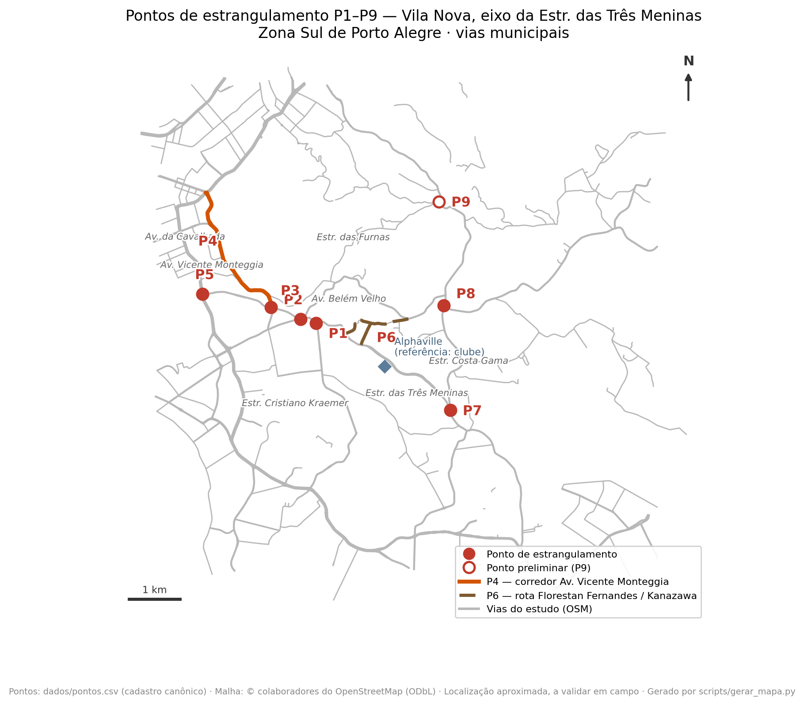

# Anexo — Pontos de atenção mapeados (síntese para vistoria)

> Anexo ao [ofício à SMAMUS (c/c EPTC/SMMU)](oficio-eptc-rascunho.md) e ao [memorando](memorando-externo.md). **Diagnóstico preliminar da comissão**, para orientar **vistoria técnica conjunta** — não é laudo. Os dados de sinistros são **associação preliminar por proximidade** (Dados Abertos POA), **não prova de causa**. Solicita-se, para cada ponto, **vistoria e validação técnica da SMAMUS/EPTC/SMMU**.

| Ponto | Localização | Problema relatado (a verificar) | Indício preliminar | A vistoriar / coletar |
|-------|-------------|----------------------------------|--------------------|------------------------|
| **P1** | Rótula Estr. Três Meninas × Estr. Cristiano Kraemer | Estrangulamento e conflito na rótula | ~29 sinistros (4 graves) + adequação prevista no Plano Funcional; **Parecer CTAAPS 093/2020: implantada só em 1ª etapa, projeto da 2ª fase não aprovado e falta o projeto de drenagem da adequação** | Aprovação do projeto da 2ª fase e da drenagem; geometria executada, velocidade e contagem direcional |
| **P2** | Confluência Cristiano Kraemer × Av. Belém Velho × Av. Monte Cristo | Conflito na confluência de três vias | ~58 sinistros (7 graves; motos) | Movimentos direcionais; **sinergia com o projeto da Av. Monte Cristo** |
| **P3** | Acesso à Av. Vicente Monteggia (Rodrigues da Fonseca / João Salomoni) | Dificuldade/conflito de acesso | ~44 sinistros (4 graves; motos) | Brechas de entrada, prioridade, contagem |
| **P4** | Corredor da Av. Vicente Monteggia (≈2,9 km) | Sobrecarga e gravidade no corredor | Sinistros graves e **2 fatais** no corredor; trecho mais crítico entre Estr. João Vedana e Estr. João Passuelo (~67 sinistros, 9 graves, 1 fatal); **tempos de viagem (sonda): o corredor mais lento, atraso ~1,3–1,4× no pico (p85 até ~1,9×)** | Contagem por trecho; velocidades; **vistoriar trechos prioritários** |
| **P5** | Conversão Av. João Salomoni → Av. da Cavalhada | Conversão problemática | Sinistralidade no entorno da Cavalhada; **plano semafórico obtido via LAI: 13 planos por horário, ciclos de 55 a 130 s, 2 estágios** (Informação Técnica EPTC nº 40664080) | Volume da conversão, travessia, ônibus; **confirmar se o movimento relatado tem fase dedicada** |
| **P6** | Acesso à Av. Dr. Vergara (via Florestan Fernandes / Estr. Kanazawa) | Rota precária (trecho não pavimentado) | Precariedade física + estudos dos dois acessos exigidos em 2013; **Parecer CTAAPS 093/2020: projetos de Kanazawa e Florestan Fernandes aprovados e "nenhuma foi implantada"**; **Decreto nº 20.859/2020 declarou a desapropriação** na esquina com a Kanazawa (1.806,73 m²) | Efetivação da desapropriação e implantação dos projetos aprovados; largura, drenagem, calçadas e função de rede |
| **P7** | Acesso à Estr. Costa Gama, sentido bairro–centro | Sem conversão à esquerda; retorno distante | ~18 sinistros; **projeto geométrico aprovado na CTAAPS/2013 obtido via LAI — 1ª etapa + solução definitiva com conector a oeste — hoje caducado** (Dec. 20.659/2020); **a "alça de ligação" está nomeada no Decreto nº 20.860/2020, que declarou a desapropriação da área (1.334,07 m²)**; **2ª fase nunca implantada** (Parecer CTAAPS 093/2020); **sinalização viária nunca aprovada** para a nova interseção — confirmado pela EPTC, que orientou novo pedido à SMMU (Pedido 1→15); **sonda: a rota legal (com o retorno) custa ≈2,0× o tempo e 1,6× a distância do movimento direto** | Revalidar/atualizar o projeto (agora na **SMMU**); **confirmar o status da desapropriação** (prazo legal de 5 anos a partir de 23/12/2020); tempo do retorno e volume |
| **P8** | Cruzamento semaforizado Estr. Costa Gama × Estr. Afonso Lourenço Mariante | Filas no pico | ~36 sinistros (4 graves; motos); **sonda: atraso ~1,3× no pico (sentido Mariante→Costa Gama)**; **plano semafórico obtido via LAI: 15 planos por horário, ciclos de 55 a 160 s, 3 estágios** (Informação Técnica EPTC nº 40691572) | Fila residual e volume por aproximação, agora com os tempos de verde oficiais como referência |
| **P9** *(preliminar)* | Entroncamento Rua Santuário × Av. Oscar Pereira | Fila para a conversão à esquerda na Av. Oscar Pereira em dias de maior fluxo | ~17 sinistros (2 graves; 6 motos) por proximidade (≤100 m); **novo ponto (reunião 13/08/2026), georreferenciado por pin** | Volume e brechas para a conversão à esquerda no pico; geometria, prioridade e travessia; contagem direcional |

*Observação: dados de sinistros referentes a recortes por proximidade da malha viária (≤100 m em interseções; corredor inteiro em P4 — escalas não comparáveis entre si, razão pela qual P4 é apresentado por trecho). Pontos sem número expressivo de sinistros (ex.: P6) sustentam-se por outras evidências (precariedade física, função de rede). Em interseções sobre vias de tráfego intenso, parte das ocorrências no raio de 100 m pode pertencer ao corredor e não ao nó — é uma das validações solicitadas à EPTC. Contato: Comissão Viária Estrada das Três Meninas — comissao.viaria@outlook.com.*

**Demandas adicionais de continuidade viária (preliminares, a validar).** Além dos pontos acima, a comissão registra duas demandas de continuidade, apresentadas para avaliação técnica:

- **D2 — Retorno seguro no eixo da Estr. das Três Meninas.** Avaliar a implantação de um retorno que reduza percursos e manobras de risco — em linha, inclusive, com os **retornos no canteiro central** já previstos, em tese, no projeto do corredor. A validar quanto a localização, volume e segurança.
- **D3 — Avaliação de capacidade da Estr. Cristiano Kraemer** (trecho entre a rótula da Vila Nova e a Estr. das Três Meninas). Verificar, com contagens da EPTC, se a seção atual comporta a demanda — inclusive a decorrente dos **empreendimentos em licenciamento no eixo** —, dimensionando eventual ampliação de capacidade.

**Evidência documental — obrigações pactuadas e projetos parados.** Documentação oficial obtida em jul–ago/2026 (respostas LAI e documentos repassados pela administração do empreendimento) mostra que boa parte do que se pede **já foi pactuada, projetada e aprovada** pelo Município, sem conclusão: o Termo de Compromisso do licenciamento **não tem prazo de validade** (a cláusula de 30 meses foi suprimida por aditivo em 2012); o **Parecer CTAAPS nº 093/2020** registra que as **2ªs fases das interseções com a Cristiano Kraemer (P1), a Kanazawa e a Florestan Fernandes (P6) e a Costa Gama (P7) não foram implantadas**; e **três decretos de 23/12/2020** declararam de utilidade pública as áreas necessárias — inclusive a da **"alça de ligação" do P7** (Decreto nº 20.860/2020). A própria **EPTC recomendou, em 2020, revisar os projetos** em razão do tempo decorrido. Cronologia resumida em [linha do tempo documental](linha-do-tempo-documental.md); detalhamento e fontes em [projetos viários documentados](projetos-viarios-ja-aprovados.md).

**Evidência de fluidez — sonda própria de tempos de viagem** (Google Routes API, série iniciada em 04/07/2026, medindo 12 rotas nos picos e fins de semana): confirma o **corredor da Av. Vicente Monteggia (P4)** como o mais lento e mede o **custo do retorno distante do P7** — a rota legalmente disponível custa ≈2,0× o tempo e 1,6× a distância do movimento direto permitido. São **indicadores próprios, indicativos** — não substituem contagens e medições da EPTC/SMMU. Agregados em [dados/tratados/sonda_tempos_resumo.md](../dados/tratados/sonda_tempos_resumo.md).
